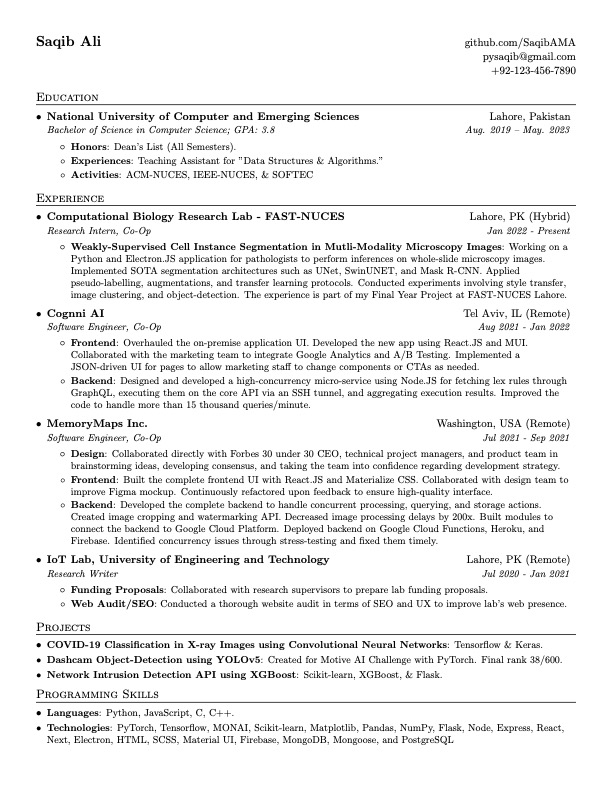

# Resume
This is a single-page resume tailored towards outgoing students. The template has been adapted from [Sourabh Bajaj's repository](https://github.com/sb2nov/resume). I am uploading it so that others with similar experience can modify and easily make it their own.

## Preview


## Getting Started
To get started, follow the below listed steps.

1 - Clone the repository

2 - Go to [overleaf.com](https://overleaf.com) and create a new project.

3 - Upload the file ```resume.tex``` from the ```src/``` folder to the project.

4 - Compile the project and you're good to go!

## Credits & License
Adapted from: [Sourabh Bajaj's Repository](https://github.com/sb2nov/resume).

License information is provided in original repository.