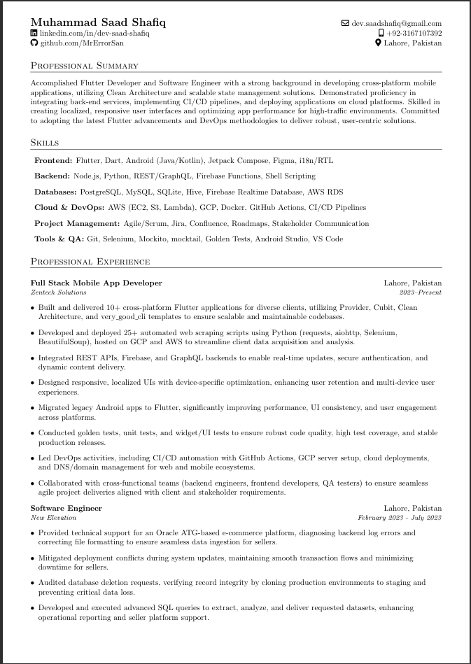

# My CV

[**Download Full CV (PDF)**](CV.pdf)

## Getting Started

1. Clone this repository.
2. Go to [Overleaf](https://overleaf.com) and create a new project.
3. Upload the file `My CV.tex`.
4. Compile and update as needed.
